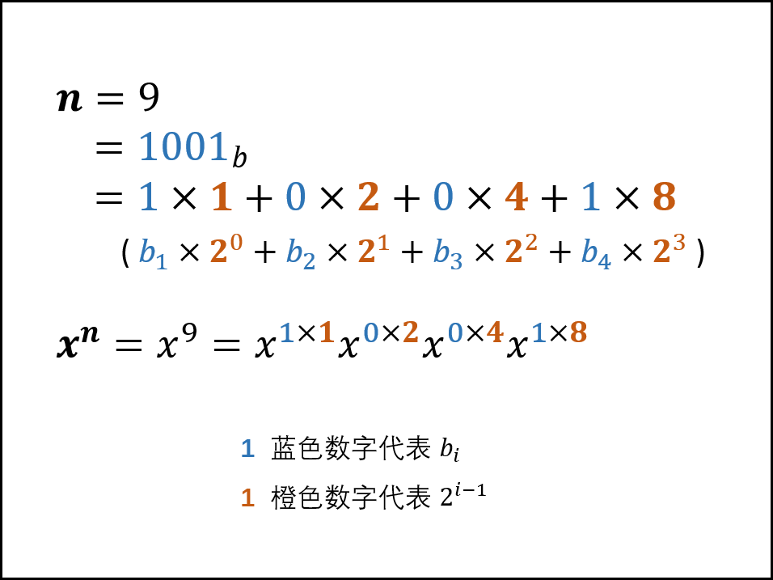

# [50. Pow(x, n)](https://leetcode.com/problems/powx-n/)

## 题目

Implement [pow(*x*, *n*)](http://www.cplusplus.com/reference/valarray/pow/), which calculates *x* raised to the power *n* (xn).

**Example 1:**

    Input: 2.00000, 10
    Output: 1024.00000

**Example 2:**

    Input: 2.10000, 3
    Output: 9.26100

**Example 3:**

    Input: 2.00000, -2
    Output: 0.25000
    Explanation: 2-2 = 1/22 = 1/4 = 0.25

**Note:**

- -100.0 < *x* < 100.0
- *n* is a 32-bit signed integer, within the range [−2^31, 2^31− 1]

## 题目大意

实现 pow(x, n) ，即计算 x 的 n 次幂函数。

## 解题思路

- 要求计算 Pow(x, n)
- 这一题用递归的方式，不断的将 n 2 分下去。注意 n 的正负数，n 的奇偶性。

大佬解析：
https://leetcode.cn/problems/shu-zhi-de-zheng-shu-ci-fang-lcof/solution/mian-shi-ti-16-shu-zhi-de-zheng-shu-ci-fang-kuai-s/

