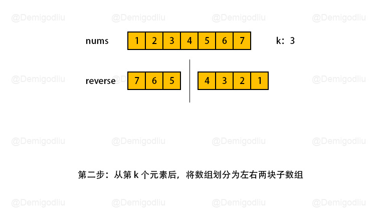

# [189. Rotate Array](https://leetcode.com/problems/rotate-array/)

## 题目

Given an array, rotate the array to the right by *k* steps, where *k* is non-negative.

**Follow up:**

- Try to come up as many solutions as you can, there are at least 3 different ways to solve this problem.
- Could you do it in-place with O(1) extra space?

**Example 1:**

```
Input: nums = [1,2,3,4,5,6,7], k = 3
Output: [5,6,7,1,2,3,4]
Explanation:
rotate 1 steps to the right: [7,1,2,3,4,5,6]
rotate 2 steps to the right: [6,7,1,2,3,4,5]
rotate 3 steps to the right: [5,6,7,1,2,3,4]
```

**Example 2:**

```
Input: nums = [-1,-100,3,99], k = 2
Output: [3,99,-1,-100]
Explanation: 
rotate 1 steps to the right: [99,-1,-100,3]
rotate 2 steps to the right: [3,99,-1,-100]
```

**Constraints:**

- `1 <= nums.length <= 2 * 10^4`
- `-2^31 <= nums[i] <= 2^31 - 1`
- `0 <= k <= 10^5`

## 题目大意

给定一个数组，将数组中的元素向右移动 k 个位置，其中 k 是非负数。

## 解题思路

- 解法二，使用一个额外的数组，先将原数组下标为 i 的元素移动到 `(i+k) mod n` 的位置，再将剩下的元素拷贝回来即可。

- 解法一，由于题目要求不能使用额外的空间，所以本题最佳解法不是解法二。翻转最终态是，末尾 `k mod n` 个元素移动至了数组头部，剩下的元素右移 `k mod n` 个位置至最尾部。确定了最终态以后再变换就很容易。先将数组中所有元素从头到尾翻转一次，尾部的所有元素都到了头部，然后再将 `[0,(k mod n) − 1]` 区间内的元素翻转一次，最后再将 `[k mod n, n − 1]` 区间内的元素翻转一次，即可满足题目要求。





## 代码

```go
package leetcode

// 解法一 时间复杂度 O(n)，空间复杂度 O(1)
func rotate(nums []int, k int) {
	k %= len(nums)
	reverse(nums)
	reverse(nums[:k])
	reverse(nums[k:])
}

func reverse(a []int) {
	for i, n := 0, len(a); i < n/2; i++ {
		a[i], a[n-1-i] = a[n-1-i], a[i]
	}
}

// 解法二 时间复杂度 O(n)，空间复杂度 O(n)
func rotate1(nums []int, k int) {
	newNums := make([]int, len(nums))
	for i, v := range nums {
		newNums[(i+k)%len(nums)] = v
	}
	copy(nums, newNums)
}
```