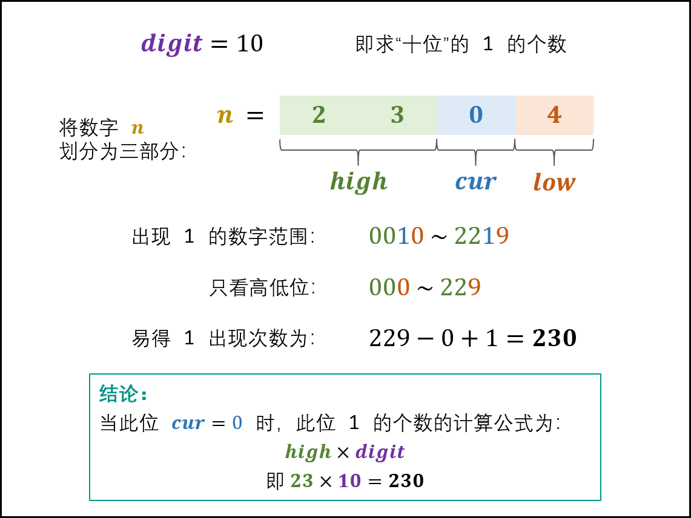
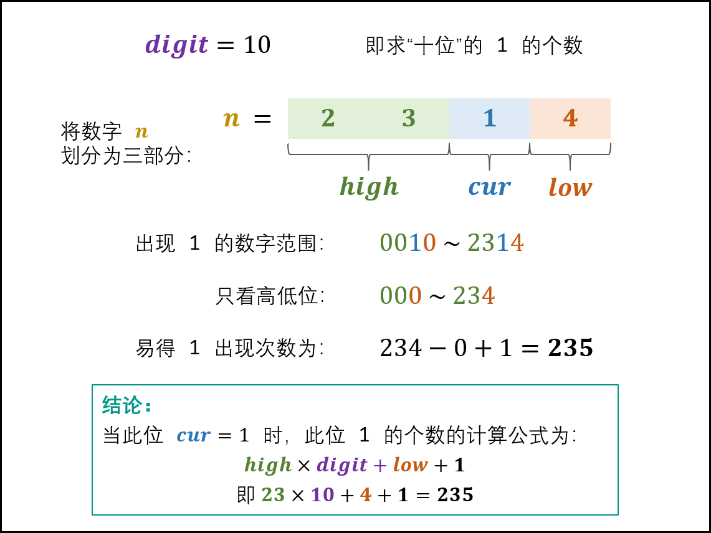
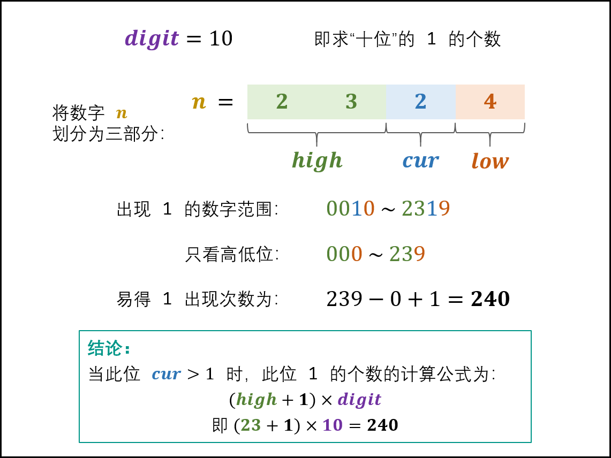

233. 数字 1 的个数
     给定一个整数 n，计算所有小于等于 n 的非负整数中数字 1 出现的个数。

示例 1：

输入：n = 13
输出：6
示例 2：

输入：n = 0
输出：0

提示：

0 <= n <= 109

解题思路：
按位计算，下图是假设计算10位时不同场景计算方式

作者：jyd
链接：https://leetcode.cn/problems/1nzheng-shu-zhong-1chu-xian-de-ci-shu-lcof/solution/mian-shi-ti-43-1n-zheng-shu-zhong-1-chu-xian-de-2/
来源：力扣（LeetCode）
著作权归作者所有。商业转载请联系作者获得授权，非商业转载请注明出处。