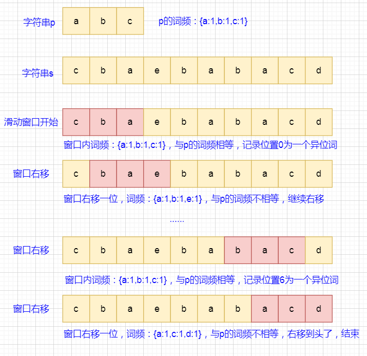

# [438. Find All Anagrams in a String](https://leetcode.com/problems/find-all-anagrams-in-a-string/)

## 题目

Given a string s and a non-empty string p, find all the start indices of p's anagrams in s.

Strings consists of lowercase English letters only and the length of both strings s and p will not be larger than 20,100.

The order of output does not matter.


Example 1:

```c
Input:
s: "cbaebabacd" p: "abc"

Output:
[0, 6]

Explanation:
The substring with start index = 0 is "cba", which is an anagram of "abc".
The substring with start index = 6 is "bac", which is an anagram of "abc".
```

Example 2:

```c
Input:
s: "abab" p: "ab"

Output:
[0, 1, 2]

Explanation:
The substring with start index = 0 is "ab", which is an anagram of "ab".
The substring with start index = 1 is "ba", which is an anagram of "ab".
The substring with start index = 2 is "ab", which is an anagram of "ab".
```

## 题目大意

给定一个字符串 s 和一个非空字符串 p，找出 s 中的所有是 p 的 Anagrams 字符串的子串，返回这些子串的起始索引。Anagrams 的意思是和一个字符串的所有字符都一样，只是排列组合不同。

## 解题思路

这道题是一道考“滑动窗口”的题目。和第 3 题，第 76 题，第 567 题类似的。解法也是用 freq[256] 记录每个字符的出现的频次次数。滑动窗口左边界往右滑动的时候，划过去的元素释放次数(即次数 ++)，滑动窗口右边界往右滑动的时候，划过去的元素消耗次数(即次数 \-\-)。右边界和左边界相差 len(p) 的时候，需要判断每个元素是否都用过一遍了。具体做法是每经过一个符合规范的元素，count 就 \-\-，count 初始值是 len(p)，当每个元素都符合规范的时候，右边界和左边界相差 len(p) 的时候，count 也会等于 0 。当区间内有不符合规范的元素(freq < 0 或者是不存在的元素)，那么当区间达到 len(p) 的时候，count 无法减少到 0，区间右移动的时候，左边界又会开始 count ++，只有当左边界移出了这些不合规范的元素以后，才可能出现 count = 0 的情况，即找到 Anagrams 的情况。




